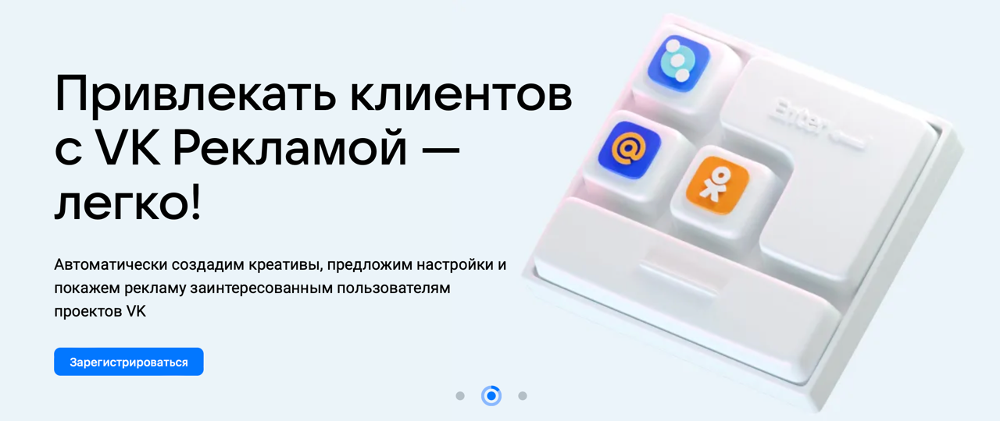

# Чек-листы | VK Реклама
### Ссылка на проект: https://ads.vk.com

## Навбар
### Авторизация: не требуется

- При нажатии на лого `VK Реклама` происходит редирект на [Главная страница](https://ads.vk.com)
- При нажатии на `Новости` происходит редирект на [Новости](https://ads.vk.com/news)
- При нажатии на `Кейсы` происходит редирект на [Кейсы](https://ads.vk.com/cases)
- При нажатии на `Форум идей` происходит редирект на [Форум идей](https://ads.vk.com/upvote)
- При нажатии на `Монетизация` происходит редирект на [Монетизация](https://ads.vk.com/partner)
- При нажатии на `Справка` происходит редирект на [Справка](https://ads.vk.com/help)
- При нажатии на `Перейти в кабинет` происходит редирект в [Личный кабинет](https://ads.vk.com/hq/registration)
- При наведении курсора на компоненты навбара происходит анимация выделения  
  
- При наведении курсора на `Обучение` происходит раскрытие выпадающего меню  
  
- При нажатии на `Полезные материалы` происходит редирект на [Полезные материалы](https://ads.vk.com/insights)
- При нажатии на `Мероприятия` происходит редирект на [Мероприятия](https://ads.vk.com/events)
- При нажатии на `Видеокурсы` происходит редирект на [Видеокурсы](https://expert.vk.com/catalog/courses/)
- При нажатии на `Сертификация` происходит редирект на [Сертификация](https://expert.vk.com/certification/)
- При наведении на элементы выпадающего списка происходит анимация выделения

## Футбар
### Авторизация: не требуется

- При нажатии на лого `VK Реклама` происходит редирект на [Главная страница](https://ads.vk.com)
- При нажатии на `Перейти в кабинет` происходит редирект в [Личный кабинет](https://ads.vk.com/hq/registration)
- При наведении на элементы в блоке "Разделы" происходит анимация выделения  
  
- При нажатии на `Новости` происходит редирект на [Новости](https://ads.vk.com/news)
- При нажатии на `Полезные материалы` происходит редирект на [Полезные материалы](https://ads.vk.com/insights)
- При нажатии на `Мероприятия` происходит редирект на [Мероприятия](https://ads.vk.com/events)
- При нажатии на `Документы` происходит редирект на [Документы](https://ads.vk.com/documents)
- При нажатии на `Обучение для бизнеса` происходит редирект на [Обучение для бизнеса](https://expert.vk.com)
- При нажатии на `Кейсы` происходит редирект на [Кейсы](https://ads.vk.com/cases)
- При нажатии на `Помощь` происходит редирект на [Справка](https://ads.vk.com/help)
- При нажатии на `Монетизация` происходит редирект на [Монетизация](https://ads.vk.com/partner)

## [Главная страница](https://ads.vk.com)
### Авторизация: не требуется

- Пользователя встречает слайд-шоу с описанием основных преимуществ проекта:  
  
  
  
- Время переключения всех слайдов одинаковое - 7 сек.
- Внизу слайда есть компонент с анимацией, показывающий переключение слайдов  

- При нажатии на `Получить бонус` редирект на https://ads.vk.com/promo/firstbonus  

- При нажатии на `Зарегистрироваться` редирект на https://ads.vk.com/hq  

- На странице представлены несколько успешных кейсов  
  
- При нажатии кнопки `Смотреть все` редирект на https://ads.vk.com/cases  
  
- При наведении на карточку кейсов воспроизводится анимация приближения  
  
- При клике на карточку кейса редирект на страницу кейса
- На странице представлена информация об обучающих вебинара по использованию ВК Рекламы  
  
- При нажатии на любую область баннера редирект на https://ads.vk.com/events
- На странице есть баннер со статической релевантной новостью  
  
- При клике в область новости происходит редирект на страницу этой новости 

## [Новости](https://ads.vk.com/news)
### Авторизация: не требуется

- Сверху страницы пользователя встречает баннер с описанием страницы  
  
- На странице представлены карточки с новостями  
  
- На каждой карточке указана дата публикации новости
- Новости расположены в порядке публикации (сверху самые актуальные)
- Самое последнее обновление расположено в самом вверху и выделено 
- При клике на `Подробнее` в области актуальной новости редирект на её страницу
- При клике по карточке новости происходит редирект на страницу новости
- При клике по заголовку новости происходит редирект на страницу новости
- На странице конкретной новости по клику по `<- Новости` редирект на [Новости](https://ads.vk.com/news)   
  
- При редиректе со страницы конкретной новости на страницу всех новостей по кнопке `<- Новости` происходит
редирект наверх страницы, а не в место, где находится соответствующая новость
- При заходе на страницу какой-то новости и возврату по кнопке "Назад" в браузере - редирект в неопределённое 
место страницы (не в начало и не к расположению соответствующей новости)

## [Кейсы](https://ads.vk.com/cases)
### Авторизация: не требуется

- Сверху страницы пользователя встречает баннер с описанием страницы  
  
- На странице представлены карточки с кейсами  
  
- На каждой карточке указана дата публикации кейса
- Кейсы расположены в порядке публикации (сверху самые актуальные)
- Самый свежий кейс расположен в самом вверху и выделен
- При клике на `Подробнее` в области актуального кейса редирект на страницу с его описанием
- При клике по карточке кейса происходит редирект на его страницу
- При клике по заголовку кейса происходит редирект на его страницу
- При наведении на карточку кейса происходит анимация приближения  
  
- На странице конкретного кейса по клику по `<- Кейсы` редирект на [Кейсы](https://ads.vk.com/cases)   
  
- При редиректе со страницы конкретного кейса на страницу всех кейсов по кнопке `<- Кейсы` происходит
  редирект наверх страницы, а не в место, где находится соответствующий кейс
- При заходе на страницу какого-то кейса и возврату по кнопке "Назад" в браузере - редирект в неопределённое
  место страницы (не в начало и не к расположению соответствующего кейса)

## [Полезные материалы](https://ads.vk.com/insights)
### Авторизация: не требуется

- Сверху страницы пользователя встречает баннер с описанием страницы  
  
- На странице представлены карточки со статьями  
  
- На каждой карточке указана дата публикации статьи
- Статьи расположены в порядке публикации (сверху самые актуальные)
- Самая новая статья расположена в самом вверху и выделена
- При клике на `Подробнее` в области актуальной статьи редирект на её страницу
- При клике по карточке статьи происходит редирект на её страницу
- При клике по заголовку новости происходит редирект на её страницу
- На странице конкретной новости по клику по `<- Полезные материалы` редирект на [Полезные материалы](https://ads.vk.com/insights)   
  
- При редиректе со страницы конкретной статьи на страницу всех статей по кнопке `<- Полезные материалы` происходит
  редирект наверх страницы, а не в место, где находится соответствующая новость
- При заходе на страницу какой-то новости и возврату по кнопке "Назад" в браузере - редирект в неопределённое
  место страницы (не в начало и не к расположению соответствующей новости)

## [Мероприятия](https://ads.vk.com/events)
### Авторизация: не требуется

- Сверху страницы пользователя встречает баннер с описанием страницы  
  
- На странице представлены карточки с мероприятиями  
  
- На каждой карточке указана дата проведения мероприятия
- Запланированные мероприятия расположены в порядке проведения (сверху самые актуальные)
- Прошедшие мероприятия расположены в обратном порядке проведения (сверху недавно проведённые)
- При клике на `Подробнее` в области карточки редирект на страницу с описанием мероприятия
- При клике по карточке мероприятия происходит редирект на его страницу
- При клике по заголовку мероприятия происходит редирект на его страницу
- При наведении на карточку мероприятия происходит анимация затемнения  
  
- На странице конкретного мероприятия по клику по `<- Мероприятия` редирект на [Мероприятия](https://ads.vk.com/events)   
  
- При редиректе со страницы конкретного мероприятия на страницу всех мероприятий по кнопке `<- Мероприятия` происходит
  редирект наверх страницы, а не в место, где находится соответствующее мероприятие
- При заходе на страницу какого-то мероприятия и возврату по кнопке "Назад" в браузере - редирект в неопределённое
  место страницы (не в начало и не к расположению соответствующего мероприятия)
